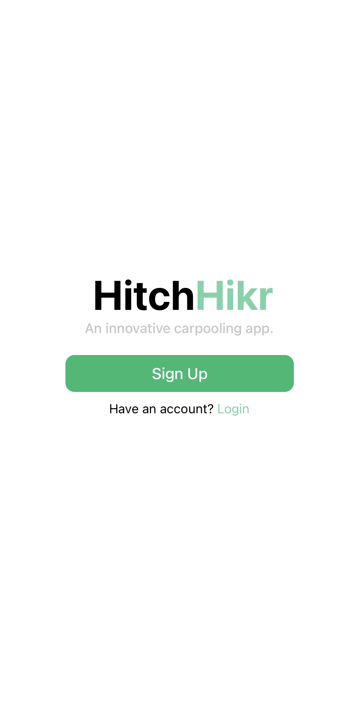
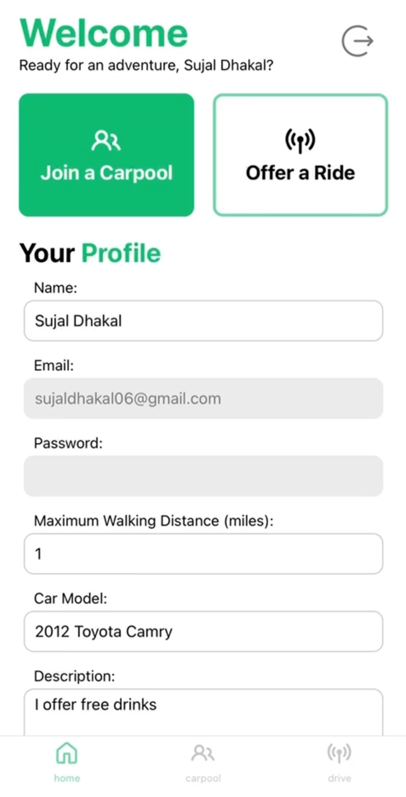
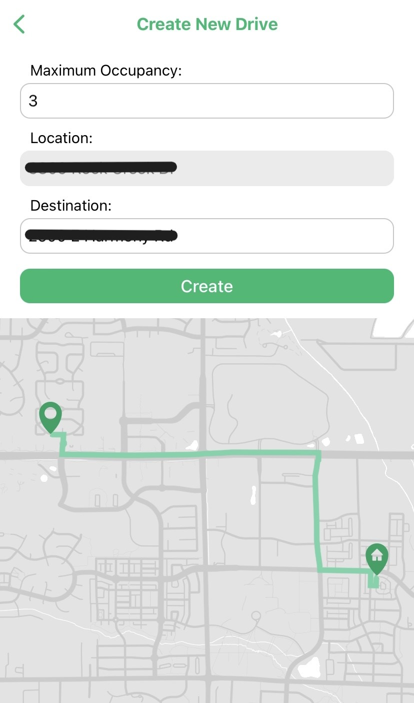
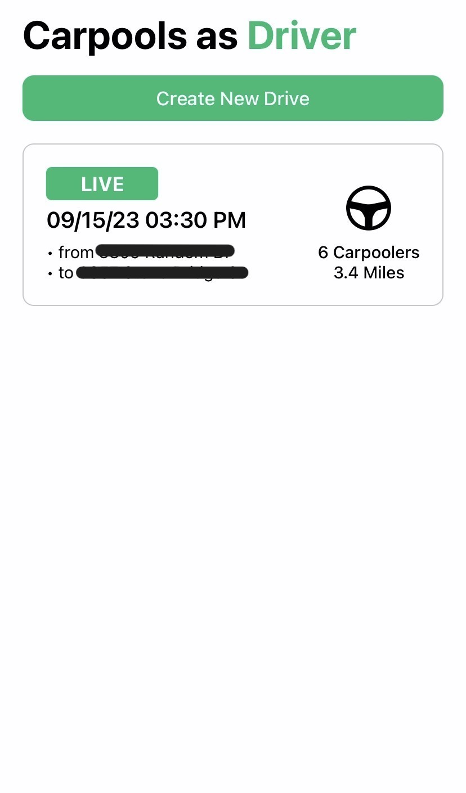
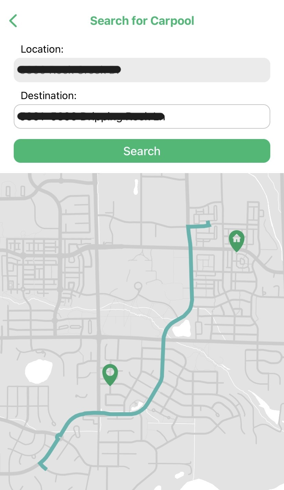
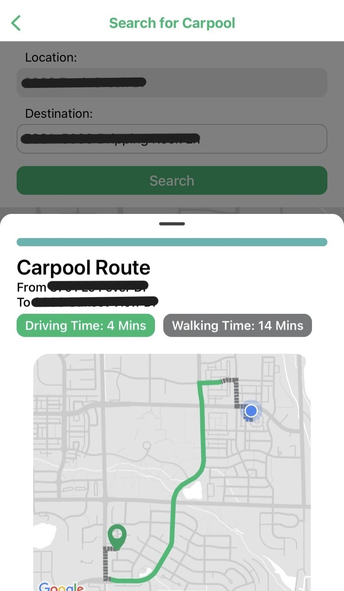

# HitchHikr

*Images Included*

HitchHikr is a dynamic carpooling app where drivers set routes and carpoolers join at convenient points, optimizing for minimal walking distance and efficient commutes.

## How it works

**1. Users can create drives or join carpools.**
- To create a drive, necessary information like the car model, a description, and an image is required.
- To join a carpool, a maximum walking distance is required.

    
    

**2. Drive Creation**
- You select a maximum occupancy of your ride and mark the destination you will be going

    
    

**3. Joining a Carpool**
- To join a carpool, you first have to select the destination you want to go
- This will show colored routes onto your map which you can select
- When you select, you can see the route, driving time, walking time, and a request to join the drive

    
    